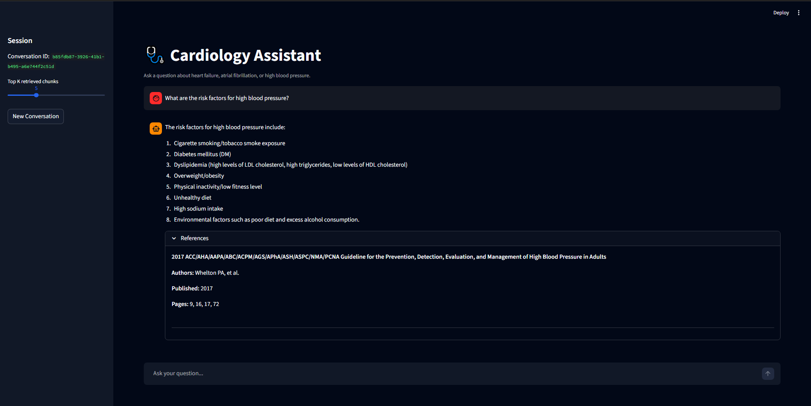
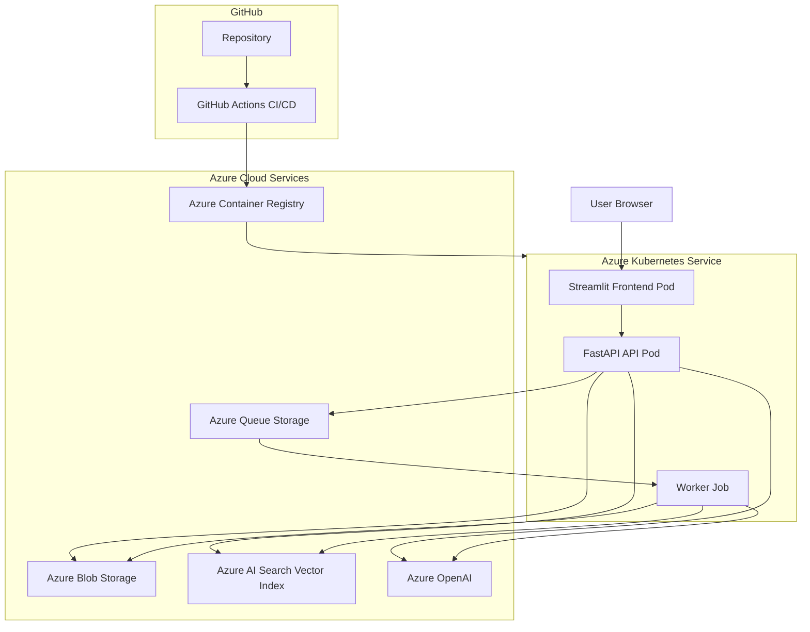

# Cardiology Assistant (Cloud-Native RAG System)


---

# Overview

Cardiology Assistant is a cloud-native Retrieval-Augmented Generation (RAG) application deployed on Microsoft Azure.

The application allows users to ask natural language questions over a curated cardiology reference set, including guidelines for:

- Atrial fibrillation
- Heart failure
- High blood pressure

The system retrieves relevant document chunks from Azure AI Search, generates grounded answers using Azure OpenAI, and returns structured references with publication metadata and page numbers.

This project demonstrates a production-style AI and cloud architecture using:

- **FastAPI** backend
- **Streamlit** frontend
- **Azure OpenAI** for embeddings and answer generation
- **Azure AI Search** for vector and hybrid retrieval
- **Azure Blob Storage** for uploaded PDFs
- **Azure Queue Storage** for asynchronous document processing
- **Docker** containerization
- **Azure Container Registry**
- **Azure Kubernetes Service**
- **GitHub Actions CI/CD**
- **Terraform Infrastructure-as-Code**

> Note: This project uses publicly available cardiology reference documents only. No real patient data is used.

---

# Live Demo

The application was deployed to Azure Kubernetes Service using Docker containers and Azure Container Registry.

- Frontend: `http://4.157.156.253`
- Local Frontend: `http://localhost:8501`
- Local API Docs: `http://127.0.0.1:8000/docs`

Example questions:

- How is atrial fibrillation diagnosed?
- What are the stages of heart failure?
- What are the risk factors for high blood pressure?
- What are the treatment options for atrial fibrillation?

The assistant returns grounded answers with references to the indexed cardiology guidelines.

> The AKS cluster may be stopped when not actively demoing to reduce cloud costs.

---

# Screenshot

## Frontend Demo



---

# Architecture



---

# System Architecture Overview

```text
User Browser
      │
      ▼
Streamlit Frontend (AKS Pod)
      │
      ▼
FastAPI Backend (AKS Pod)
      ├── Azure OpenAI
      │     ├── Embeddings
      │     └── Chat completion
      │
      ├── Azure AI Search
      │     └── Vector + keyword retrieval
      │
      ├── Azure Blob Storage
      │     └── Uploaded PDF documents
      │
      └── Azure Queue Storage
            └── Document ingestion messages
                  │
                  ▼
            Worker Job (AKS)
                  ├── PDF extraction
                  ├── Page-aware chunking
                  ├── Embedding generation
                  └── Vector indexing
```

Key concepts demonstrated:

- **Cloud-native AI architecture**
- **Retrieval-Augmented Generation**
- **Vector search and hybrid retrieval**
- **Asynchronous document ingestion**
- **Containerized microservices**
- **Kubernetes deployment**
- **Infrastructure-as-Code using Terraform**
- **CI/CD automation with GitHub Actions**

---

# Core Features

- Upload cardiology PDF references
- Store uploaded PDFs in Azure Blob Storage
- Queue document ingestion jobs with Azure Queue Storage
- Process PDFs asynchronously using a worker service
- Extract text from PDFs page by page
- Chunk documents into page-aware sections
- Generate embeddings with Azure OpenAI
- Store embeddings and metadata in Azure AI Search
- Retrieve relevant chunks using hybrid search
- Rewrite follow-up questions into standalone search queries
- Generate grounded answers using Azure OpenAI
- Return structured references with:
  - document title
  - authors
  - publication date
  - cited pages

- Support multi-turn conversation memory
- Provide a Streamlit chat interface
- Deploy containers to AKS
- Automate builds and deployments with GitHub Actions

---

# Current Reference Corpus

The current demo corpus is intentionally scoped to high-impact cardiology guidelines:

- **2023 ACC/AHA/ACCP/HRS Guideline for the Diagnosis and Management of Atrial Fibrillation**
- **2022 AHA/ACC/HFSA Guideline for the Management of Heart Failure**
- **2017 ACC/AHA Guideline for High Blood Pressure in Adults**

The application scope is intentionally limited to heart failure, atrial fibrillation, and high blood pressure to improve answer quality, reduce hallucination risk, and control cloud costs.

---

# Retrieval-Augmented Generation Flow

When a user asks a question:

1. The Streamlit frontend sends the question to the FastAPI backend.
2. The backend retrieves recent conversation history.
3. Azure OpenAI rewrites follow-up questions into standalone retrieval queries.
4. The rewritten question is embedded using Azure OpenAI.
5. Azure AI Search performs hybrid retrieval using:
   - vector similarity search
   - keyword search

6. The backend retrieves the most relevant document chunks.
7. Azure OpenAI generates an answer using only the retrieved context.
8. The backend returns:
   - answer text
   - grouped references
   - source page numbers

9. The frontend displays the response and references.

Example reference output:

```text
2022 AHA/ACC/HFSA Guideline for the Management of Heart Failure
Authors: Heidenreich PA, et al.
Published: 2022
Pages: 63, 94, 110
```

---

# Document Ingestion Flow

Document processing is handled asynchronously.

```text
PDF Upload
      │
      ▼
Azure Blob Storage
      │
      ▼
Azure Queue Storage
      │
      ▼
Worker Job
      ├── Download PDF
      ├── Extract page-aware text
      ├── Split text into chunks
      ├── Generate embeddings
      └── Upload vectors to Azure AI Search
```

This decouples file upload from document processing and mirrors production-style ingestion pipelines.

---

# Cloud Engineering Skills Demonstrated

- Azure Kubernetes Service deployment
- Azure Container Registry image hosting
- Docker containerization
- Multi-container application design
- Kubernetes Deployments, Services, Jobs, and Secrets
- FastAPI backend development
- Streamlit frontend development
- Azure Blob Storage integration
- Azure Queue Storage integration
- Azure AI Search vector indexing
- Azure OpenAI embeddings and chat completions
- GitHub Actions CI/CD
- Terraform Infrastructure-as-Code
- Cost-aware cloud design
- Secure secret handling using environment variables and Kubernetes Secrets

---

# Cloud Stack

### Application

- Python
- FastAPI
- Streamlit
- Pydantic
- PyPDF
- Uvicorn

### AI / Search

- Azure OpenAI
- Azure AI Search
- Vector embeddings
- Hybrid search
- Query rewriting
- Retrieval-Augmented Generation

### Azure Services

- Azure Kubernetes Service
- Azure Container Registry
- Azure Blob Storage
- Azure Queue Storage
- Azure AI Search
- Azure OpenAI

### DevOps

- Docker
- Docker Compose
- Kubernetes manifests
- GitHub Actions
- Terraform

---

# CI/CD Pipeline

GitHub Actions automates the container build and deployment process.

On push to `main`:

1. GitHub Actions checks out the repository.
2. Logs in to Azure using a service principal.
3. Builds Docker images for:
   - FastAPI API
   - Streamlit frontend
   - ingestion worker

4. Pushes images to Azure Container Registry.
5. Connects to AKS.
6. Updates Kubernetes deployments with the new image tags.
7. Rolls out the updated API and frontend pods.

```text
GitHub Push
      │
      ▼
GitHub Actions
      │
      ▼
Docker Build
      │
      ▼
Azure Container Registry
      │
      ▼
Azure Kubernetes Service
```

This creates a repeatable deployment pipeline from source code to running cloud application.

---

# Infrastructure-as-Code

Infrastructure is represented using Terraform.

Terraform definitions are located in:

```text
infra/terraform/
```

Terraform defines:

- Azure Resource Group
- Azure Storage Account
- Blob container
- Queue Storage queue
- Azure AI Search service
- Azure Container Registry
- Azure Kubernetes Service cluster
- Role assignment for AKS to pull images from ACR

Example Terraform workflow:

```bash
cd infra/terraform
terraform init
terraform fmt
terraform validate
terraform plan
```

The current Azure environment was originally created manually through the Azure Portal and Azure CLI. Because of that, Terraform is currently used as an Infrastructure-as-Code representation of the target architecture. Existing resources can be imported into Terraform state in the future.

---

# Security

Security practices demonstrated:

- Secrets are excluded from source control
- Local secrets are stored in `.env`
- Docker images do not include `.env`
- AKS uses Kubernetes Secrets for runtime configuration
- GitHub Actions uses repository secrets for Azure authentication
- Azure credentials are not hardcoded in application code

Future improvements could include:

- Azure Key Vault integration
- Managed Identity authentication
- Workload Identity for AKS
- Private networking for production environments

---

# Cost Management

This project was designed with cost control in mind.

Cost optimization strategies:

- Azure AI Search Free tier during development
- Curated cardiology corpus instead of broad medical indexing
- Tuned chunk size and overlap to reduce vector storage usage
- Azure Container Registry Basic tier
- Single-node AKS cluster for demos
- AKS cluster stopped when not in use
- Publicly available reference documents only

Chunking was optimized to reduce vector storage while maintaining retrieval quality.

Example optimization:

```text
Smaller chunks produced excessive vector storage.
Increasing chunk size reduced the Azure AI Search vector footprint while preserving useful retrieval performance.
```

---

# Repository Structure

```bash
ai-clinical-document-assistant
│
├── app/
│   ├── api/                 # FastAPI backend
│   ├── shared/              # Shared schemas and utilities
│   └── worker/              # Document ingestion worker
│
├── frontend/                # Streamlit frontend
│
├── infra/
│   └── terraform/           # Terraform Infrastructure-as-Code
│
├── k8s/                     # Kubernetes manifests
│
├── scripts/                 # Utility scripts
│
├── docs/                    # Documentation and diagrams
│
├── .github/
│   └── workflows/           # GitHub Actions CI/CD
│
├── Dockerfile.api
├── Dockerfile.frontend
├── Dockerfile.worker
├── docker-compose.yml
├── requirements.txt
├── README.md
├── LICENSE
└── .gitignore
```

---

# Project Roadmap

### Phase 1 – Core RAG Backend

- Build FastAPI backend
- Add PDF upload endpoint
- Store documents in Azure Blob Storage
- Queue ingestion jobs

### Phase 2 – Document Processing

- Extract PDF text
- Chunk text by page
- Generate Azure OpenAI embeddings
- Index chunks in Azure AI Search

### Phase 3 – Question Answering

- Add question answering endpoint
- Retrieve relevant chunks
- Generate grounded answers
- Return structured references

### Phase 4 – Product UI

- Build Streamlit chat frontend
- Add conversation memory
- Add reference display
- Add query rewriting for follow-up questions

### Phase 5 – Cloud Deployment

- Dockerize API, frontend, and worker
- Push images to Azure Container Registry
- Deploy to AKS
- Add Kubernetes manifests

### Phase 6 – DevOps and IaC

- Add GitHub Actions CI/CD
- Automate Docker image publishing
- Automate AKS rollout
- Add Terraform Infrastructure-as-Code

---
